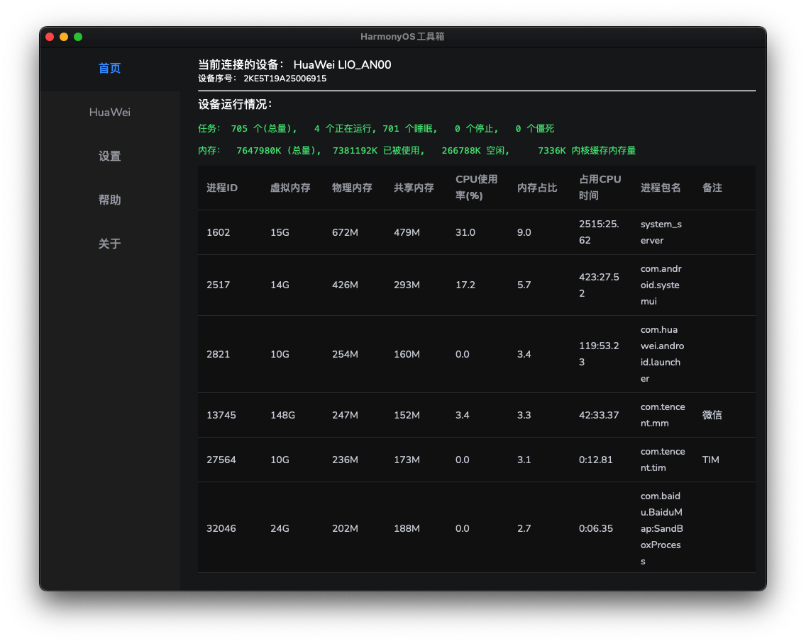
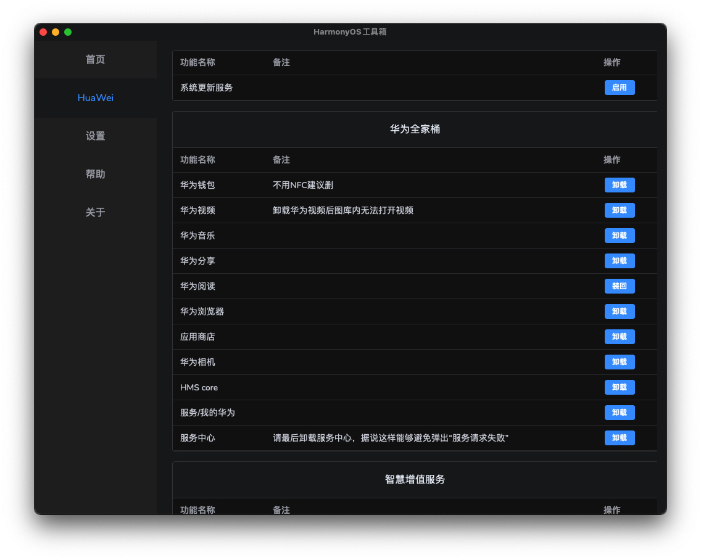

# HarmonyOS 工具箱跨平台版本[计划支持 Windows 和 MacOS]

## 所有功能均来自 <一只靓仔琦> ，请支持原作者，本代码只是将工具跨平台化

- B 站：[一只靓仔琦](https://space.bilibili.com/430813939)
- [爱发电](https://afdian.net/a/GreatGuy)

## 界面

## scrcpy 投屏原理

am stack list 查看任务栈
am force-stop packageId

## Live Development

To run in live development mode, run `wails dev` in the project directory. This will run a Vite development
server that will provide very fast hot reload of your frontend changes. If you want to develop in a browser
and have access to your Go methods, there is also a dev server that runs on http://localhost:34115. Connect
to this in your browser, and you can call your Go code from devtools.

## Building

To build a redistributable, production mode package, use `wails build`.
